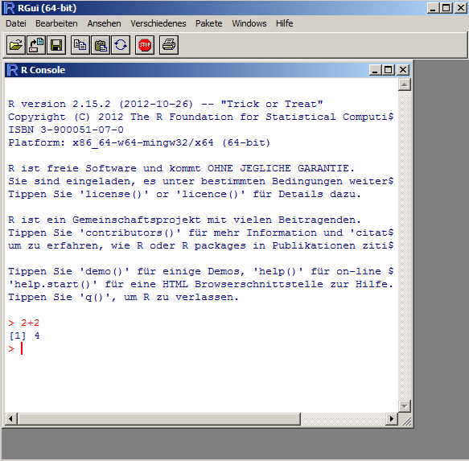
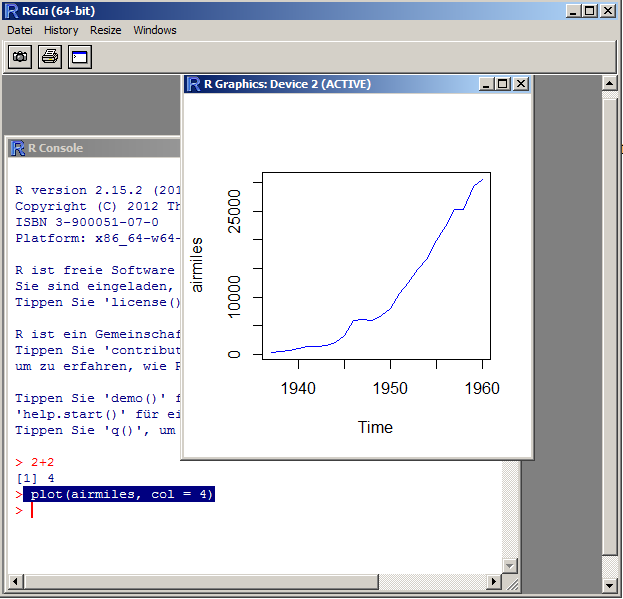
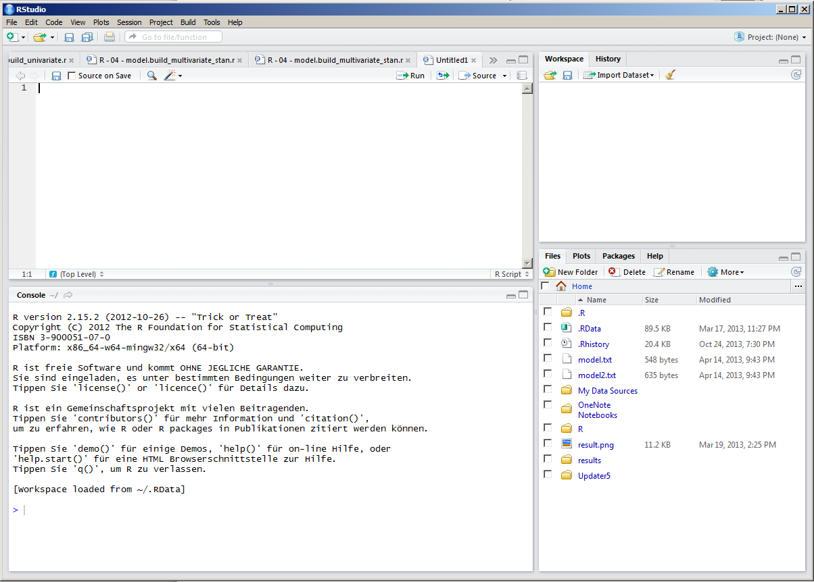
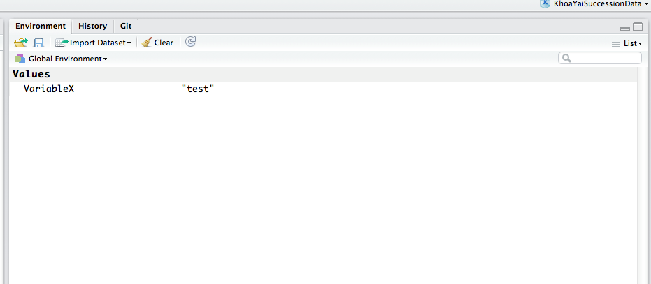

```{r, echo = F}
set.seed(123)
knitr::opts_chunk$set(fig.width=5, fig.height=5)
```


* *This practical tutorial of the [RS course](http://florianhartig.github.io/ResearchSkills/) is intended to be read together with the more detailed [Statstics lecture notes](https://www.dropbox.com/s/s38ge7pjgf55qs1/EssentialStatistics.pdf?dl=0)*

* *To run the code demonstrated here, you should install R and RStudio*

* *If you had problems to follow the practical, see links to websites with further explanations at the end of this document!*

## The R gui

We will work during this course in RStudio. RStudio is an editor that builds on R, but as a demonstration, let's have a look at the RGui first. The RGui is a simple editor that comes with the R installation (note it looks a bit different on a Mac than the windows version we show here).

To start the RGui, start the program R from your programs in Windows. Hava a look at the window popping up, and type 2+2 in the main window. After hitting enter you will end up with this:



The window you see here is called the R Console. Through the console, you interact with the core R program that does all the communcation. 

Let's write something else: R has a few standard datasets that are automatically loaded. We will be using the airmiles dataset, which shows the number of airmiles awarded over time. Let's shortly demonstrate how to do a plot with this dataset. Type:

```{r, eval=FALSE}
plot(airmiles, col = 4)
```
The result should look like this:



So, as you see, this apparently opens a new window (a graphics output) and plots airmiles against time. We'll discuss why and how this works. Before you get too used the the RGui, however, let's first move to RStudio, an alternative program to interact with R.

## The Rstudio editor
 
RStudio basically offers the same functions as the RGui, but a many things can be done easier or are handled more comfortable for you. This is how it looks like:



**Console** The console that we have already seen is in the bottom-left panel. You can confirm that it behaves in the same way by typing in the same commands as we did before, i.e. 2+2, or plot the graph.

**Editor** Above the console (top left), r script files are displayed and can be changed in the editor. The idea of a script file is that you collect all the commands that you send to the console in one file, so that you can re-run it later.  

A typical script may look like that:

```{r, eval = FALSE}
# the hash means this is treated as a comment
# this file is written by FH, 25.10.13

rm(list=ls(all=TRUE))  # this command means all variables in the memory are erase

# load some data

# do some plots

```

To send a part of the script to the console, you can use the run button on the top right border of the editor window. For everything we do from now on, I would strongly recommend writing in the script, and then sending it to console from there. 

## Variables and data structures

Who has ever worked with a programming language? In a programming language, data is stored in variables / objects. This is how we assign the word "test" to the variable "VariableX"

```{r}
VariableX = "test"
```

I can now access the variable by typing its name in the console, and it will return the value that it stores.
```{r}
VariableX
```

We can see all the variables that we have specified in the global environment or R in the top-right corner or RStudio. You see that we have here the variable "VariableX" together with it's value. 




### Data types and structures

A variable can store different things: a number, a word, a list, or a whole dataset. 

The most simple case are variables that contain a **single value** only. Here, the only question is what kind of values the variable contains. The different data types a single value can have are called the **atomic types** - think of it as the basic data types in R. Important atomic types are: 

- boolean (TRUE / FALSE)
- integer (1, 2, 3, 5)
- numeric (1.1, 2.5, 3.456)
- factor ("red", "green", "blue")
- character ("a word", "another word")

If we have a collection of several atomic types, we speak of a data structure or an object (there is a difference but it doesn't matter here). Important examples of this are: 

- **vector** (a row of the same atomic types, e.g. [1,2,3,4,5] )
- **list** (basically like a vector, but can contain different types such as [1, "red", FALSE] )
- **data.frame** (a list of vectors, this is the standard format for data in R. Think of it as a spreadsheet - each colum is a vector and can have a different type)

A full list of data types is here http://www.statmethods.net/input/datatypes.html 
 
### Checking data types and structures

Especially after reading in your data, it is important to check which type it has. The functions in R react differently depending on which atomic type you supply. 

If you want to see which type or structure a variable has, use the str command:

```{r, eval = FALSE}
str(object)
```

To get a summary of your structure (e.g. mean per column, but what exactly is summarized depends on the data structure and type), use:

```{r, eval = FALSE}
summary(object)
```

To try to make an automatic plot (R will choose what it thinks most suitable for this structure / type), type:

```{r, eval = FALSE}
plot(object)
```

Try this with the object airquality. 

## Accessing columns, rows and elements in a data.frame or matrix

As said, the most common structure in R is the data frame. Basically, columns are stored as a list of vectors, so that each column can be a different data type.

You can select columns in a number of ways:

- By name:
```{r, eval = FALSE}
airquality$Ozone
```

- By column index: 

```{r, eval = FALSE}
airquality[,1]
```

Note that here [,1] means the first column. You could get the first row by [1,].

#### Slicing

The last type of accessing is an example of slizing. Slizing is a very powerfull technique that is available in most scientific programming languages. What it means is that you can access your data by typing in colums, rows, or particular elements. Look at the following commands (explanation always below):

```{r, eval = FALSE}
airquality[,1:2]
```

gets the first colums 1 and 2.


```{r, eval = FALSE}
airquality[4:6,1]]
```

gets rows 4 to 6 in column 1


```{r, eval = FALSE}
airquality[c(1,2,3,4,7,8),1]
```

gets rows 1,2,3,4,7,8 in column 1. 

You see, we can select any combination of elemets we want very conveniently from the data frame. Even more convenient is how we can create selections.


```{r, eval = FALSE}
1:10
```

gives us the values of 1 to 10

```{r, eval = FALSE}
c(1,5,6)
```

the c() function combines values in one vector (it is neccessary to have the values in one vector for slicing)

```{r, eval = FALSE}
c(1,5,6)
```

But we can also create selections with logical operators

```{r, eval = FALSE}
airquality$Temp > 80
```

creates a vector with True on all temperature values that are > 80. I can store this and use it for selection, or use it immediately


```{r, eval = FALSE}
airquality[airquality$Temp > 80 , ]
```

selects all rows with temperature > 80.


## How to load data?

So far, we had the data already in the R program. Now, we will demonstrate how to load some data (we will use the airquality.txt file provided to you)

There are basically two options to load data

- with RStudio (point and click) - go to Environment (top right), import dataset, and follow instructions

- from the script with the read.table() command

The latter works like that


```{r, eval = FALSE}
data = read.table("airquality.txt", header = T)
```

In this case it works nice because I have prepared the data in the most easy way. If you have other data formates (commas, semicolons, header / no header), consult the help of teh read.table command. See also http://www.statmethods.net/input/importingdata.html for more options, e.g. excel or database import. 

#### Checking the data

After loading the data, always check whether the data format is correct 


```{r}
str(data)
```

You see here the atomic type of every column. Make sure it corresponds to what you want (sometimes numeric is read in as factor, or *vice versa*). If a column would have the wrong type, we have to change this by typing

```{r, eval = FALSE}
as.factor(x)
``` 
or 
```{r, eval = FALSE}
as.numeric(x)
```

Note: this data file is already included in R, so if you don't manage to load it, you can continue anyway. 

## Plotting
OK, now you know how to select data from your data.

Let's do some standard plots:

```{r, eval = FALSE}
plot(airquality)
```

automatically chooses a particular plot, namely: 
```{r}
pairs(airquality)
```

Let's plot only two variables against each other 
```{r}
plot(airquality$Ozone, airquality$Temp)
```

...or should it rather be the other way around? 

```{r}
plot(airquality$Temp , airquality$Ozone)
```
```{r}

hist(airquality$Ozone)
```

## Getting help and modifying functions
Functions in R have typically a lot of options. You get information about them by looking at the help of a function, either by clicking on the command and hitting F1, or ?functionname. try ?hist.

Default values can be overwritten
```{r}
hist(airquality$Ozone, breaks = 30, col = "darkred")
```

Find R Colors at http://research.stowers-institute.org/efg/R/Color/Chart/ 

You may further modify: 
```{r}
plot(airquality$Ozone, airquality$Temp, pch = 5)
```
...or:
```{r}
plot(airquality$Ozone, airquality$Temp, pch = 3, cex = airquality$Wind / 10, col = "darkred")
```

## Some more plotting functions

See http://www.statmethods.net/graphs/index.html 

```{r}
# Simple Bar Plot 
counts <- table(mtcars$gear)
barplot(counts, main="Car Distribution", 
   xlab="Number of Gears")
# Grouped Bar Plot
counts <- table(mtcars$vs, mtcars$gear)
barplot(counts, main="Car Distribution by Gears and VS",
  xlab="Number of Gears", col=c("darkblue","red"),
  legend = rownames(counts), beside=TRUE)

# Boxplot of MPG by Car Cylinders 
boxplot(mpg~cyl,data=mtcars, main="Car Milage Data", 
   xlab="Number of Cylinders", ylab="Miles Per Gallon")

# Notched Boxplot of Tooth Growth Against 2 Crossed Factors
# boxes colored for ease of interpretation 
boxplot(len~supp*dose, data=ToothGrowth, notch=TRUE, 
  col=(c("gold","darkgreen")),
  main="Tooth Growth", xlab="Suppliment and Dose")
```


## Modifying a function afterwards with inkscape 

Short explanation -- you can try this later: Save as a pdf, open with inkscape, modify e.g. colors of the figure, use a different background, etc.

## Fitting a model

We'll do this in more detail on Wednesday, but just as a preview:

```{r}
fit = lm(airquality$Temp~airquality$Ozone)
plot(airquality$Temp~airquality$Ozone)
abline(fit, col = "blue")

fit2 = lm(airquality$Temp~airquality$Ozone + I(airquality$Ozone^2))
```

check out ?formula to understand how to put in formulas.


## Websites with examples / tutorials

- As an R beginner, for any basic task, start with the [Quick-R website](http://www.statmethods.net/index.html)
- [This series of video lectures](http://www.youtube.com/playlist?list=UUAeWj0GhZ94wuvOIYu1XVrg) on youtube basically goes through the same steps 
- [Our department stats help](http://biometry.github.io/APES/R/R10-gettingStarted.html), which I also recommended in the stats lecture notes, has a list of written tutorials 

More examples for graphics here: 

- http://rgm3.lab.nig.ac.jp/RGM/R_image_list?page=3073&init=true 
- https://www.stat.auckland.ac.nz/~paul/RGraphics/rgraphics.html
- http://rgraphgallery.blogspot.de/search/label/heatmap 

Also, remember: google is your friend!


---
**Copyright, reuse and updates**: By Florian Hartig. Updates will be posted at http://florianhartig.github.io/ResearchSkills/. Reuse permitted under Creative Commons Attribution-NonCommercial-ShareAlike 4.0 International License


