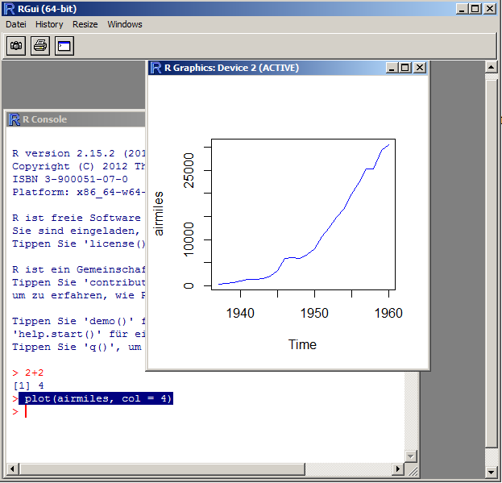

**Important** if you had problems to follow the practical, see links to websites with further explanations at the end of this document!

## The R gui

We will work in RStudio, but as a demonstration, let's have a look at the RGui first. Start up the program R from your programs in Windows. Hava a look at the window popping up, and type 2+2 in the main window. After hitting enter you will end up with this:


This main window, called the R Console, is how you interact with the core R program that does all the communcation. Let's write something else

R has a few standard datasets that are already loaded to try out stuff. Before we go to RStudio, let's try out plotting one of those. Type:
```{r, eval=FALSE}
plot(airmiles, col = 4)
```
The result should look like this:



So, as you see, this apparently plots airmiles against time. We'll discuss why and how this works, but let's first move to RStudio, an alternative program to interact with R.

## The Rstudio editor
 
RStudio basically offers the same functions as the RGui, but a few things can be done easier or are handled more comfortable for you. This is how it looks like:


The console is in the bottom-left panel try to put in the same commands as we did before, i.e. 2+2, and plot the graph

Above the console, r script files are displayed in the editor. You can work of course in the console, typing everything in directly, but typically you work in the script mode with the editor and then send the your code  to the console.

Typical script:

```{r, eval = FALSE}
# the hash means this is treated as a comment
# this file is written by FH, 25.10.13

rm(list=ls(all=TRUE))  # this command means all variables in the memory are erase

# load some data

# do some plots

```

## Variables

Who has ever worked with a programming language? In a programming language, data is stored in variables / objects
```{r}
VariableX = "test"
```

Now the content I have specified (i.e. the word "test") is stored in the computer, called workspace. Note that this is shown in RStudio in the topr-right corner, displayed as Environment:


I can access the variable by typing its name in the console, and it will return the value that is stored.
```{r}
VariableX
```

## Data types and structures
A variable can store different things: a number, a word, or a whole dataset. If it is a single value, we call it in R an atomic type. Important atomic types are: 

- boolean
- numeric
- factor
- character

If we have a collection of several atomic types, we speak of a data structure or an object (there is a difference but it doesn't matter here). Important examples of this are: 

- vector (a row of the same atomic types, e.g. 1,2,3,4,5)
- data.frame (a list of vectors, this is the standard format for data)

A full list of data types is here http://www.statmethods.net/input/datatypes.html 
 

If you want to see which type or structure a variable has:

```{r, eval = FALSE}
str(object)
```

gives you the structure of a variable / object

```{r, eval = FALSE}
summary(object)
```
tries to give you a summary, depending on the type you have

```{r, eval = FALSE}
plot(object)
```
tries to make a plot, depending on the type you have

Try this with the object airquality. 

## The data frame
The most common structure in R is the data frame. Basically, columns are stored as a list of vectors, so that each column can be a different data type.

You can select columns in a number of ways:

- By name:
```{r}
airquality$Ozone
```
- By index: 
```{r}
airquality[,1]
```


Slicing: 
```{r, eval = FALSE}
airquality[,1:2]
```
```{r, eval = FALSE}
airquality[4:6,1]]
```
```{r, eval = FALSE}
airquality[c(1,2,3,4,7,8),1]
```
What do you get?

## How to load data?
Try to load the airquality.txt file (provided to you) with 

- with RStudio (point and click)
- from the script with the read.table() command

After loading the data, always check whether the data format is correct (numeric, factors) with the str(YOURDATA) command.

After loading the data, check whether the types are as you want them (sometimes numeric is read in as factor, or *vice versa*). If a column would have the wrong type, we have to change this by typing
```{r, eval = FALSE}
as.factor(x)
``` 
or 
```{r, eval = FALSE}
as.numeric(x)
```
See http://www.statmethods.net/input/importingdata.html for more options, e.g. excel import. 

Note: this data file is already included in R, so if you don't manage to load it, you can continue anyway. 

## Plotting
OK, now you know how to select data from your data.

Let's do some standard plots:
```{r, eval = FALSE}
plot(airquality)
```

automatically chooses a particular plot, namely: 
```{r}
pairs(airquality)
```

Let's plot only two variables against each other 
```{r}
plot(airquality$Ozone, airquality$Temp)
```

...or should it rather be the other way around? 

```{r}
plot(airquality$Temp , airquality$Ozone)
```
```{r}

hist(airquality$Ozone)
```

## Getting help and modifying functions
Functions in R have typically a lot of options. You get information about them by looking at the help of a function, either by clicking on the command and hitting F1, or ?functionname. try ?hist.

Default values can be overwritten
```{r}
hist(airquality$Ozone, breaks = 30, col = "darkred")
```

Find R Colors at http://research.stowers-institute.org/efg/R/Color/Chart/ 

You may further modify: 
```{r}
plot(airquality$Ozone, airquality$Temp, pch = 5)
```
...or:
```{r}
plot(airquality$Ozone, airquality$Temp, pch = 3, cex = airquality$Wind / 10, col = "darkred")
```

## Some more plotting functions

See http://www.statmethods.net/graphs/index.html 

```{r}
# Simple Bar Plot 
counts <- table(mtcars$gear)
barplot(counts, main="Car Distribution", 
   xlab="Number of Gears")
# Grouped Bar Plot
counts <- table(mtcars$vs, mtcars$gear)
barplot(counts, main="Car Distribution by Gears and VS",
  xlab="Number of Gears", col=c("darkblue","red"),
  legend = rownames(counts), beside=TRUE)

# Boxplot of MPG by Car Cylinders 
boxplot(mpg~cyl,data=mtcars, main="Car Milage Data", 
   xlab="Number of Cylinders", ylab="Miles Per Gallon")

# Notched Boxplot of Tooth Growth Against 2 Crossed Factors
# boxes colored for ease of interpretation 
boxplot(len~supp*dose, data=ToothGrowth, notch=TRUE, 
  col=(c("gold","darkgreen")),
  main="Tooth Growth", xlab="Suppliment and Dose")
```


## Modifying a function afterwards with inkscape 

Short explanation -- you can try this later: Save as a pdf, open with inkscape, modify e.g. colors of the figure, but a different background, etc.

## Fitting a model

We'll do this in more detail on Wednesday, but just as a preview:

```{r}
fit = lm(airquality$Temp~airquality$Ozone)
plot(airquality$Temp~airquality$Ozone)
abline(fit, col = "blue")

fit2 = lm(airquality$Temp~airquality$Ozone + I(airquality$Ozone^2))
```

check out ?formula to understand how to put in formulas.


## Websites with examples / tutorials


- This series of video lectures on youtube basically goes through the same steps http://www.youtube.com/playlist?list=UUAeWj0GhZ94wuvOIYu1XVrg
- This website, which I also recommended in the stats lecture notes, has a list of written tutorials http://biometry.github.io/APES/R/R10-gettingStarted.html

- Start with http://www.statmethods.net/index.html 

More examples for graphics here: 

- http://rgm3.lab.nig.ac.jp/RGM/R_image_list?page=3073&init=true 
- https://www.stat.auckland.ac.nz/~paul/RGraphics/rgraphics.html
- http://rgraphgallery.blogspot.de/search/label/heatmap 

- http://biometry.github.io/APES/R/R10-gettingStarted.html (list with R tutorials)
 
Also, google is your friend!


