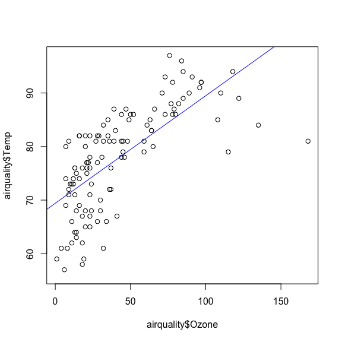
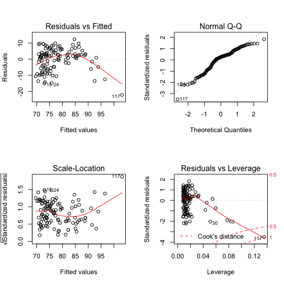
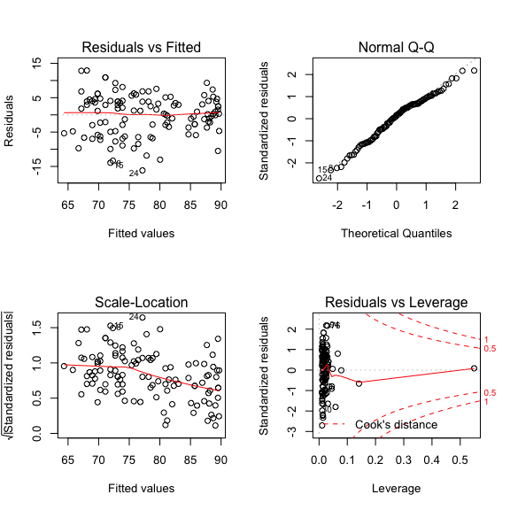
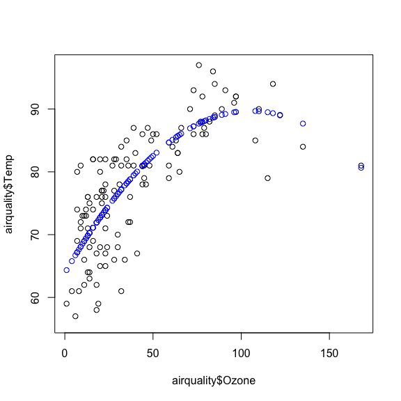
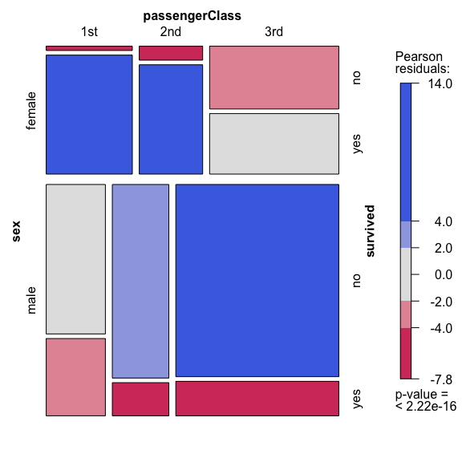
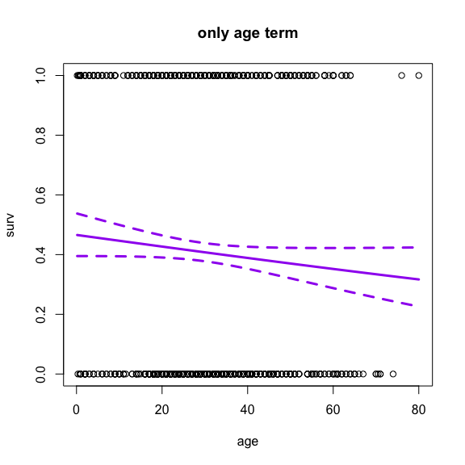
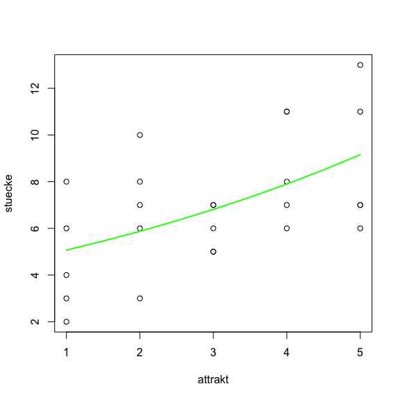
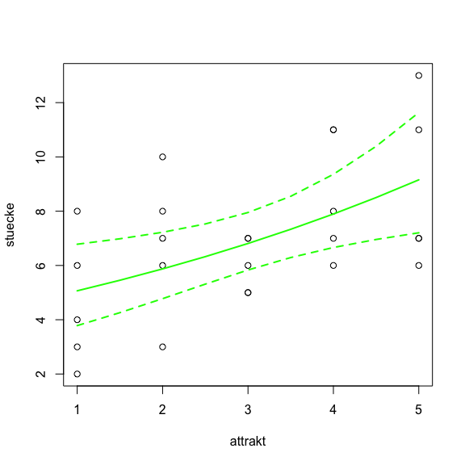

# Research Skills Practical: Regression with R (ca. 1.5h)
`r format(Sys.time(), '%d %B, %Y')`  


#### Notes for the user

* *This practical tutorial of the [RS course](http://florianhartig.github.io/ResearchSkills/) is intended to be read together with the more detailed [Statstics lecture notes](https://www.dropbox.com/s/s38ge7pjgf55qs1/EssentialStatistics.pdf?dl=0)*

* *If you had problems to follow the practical, see links to websites with further explanations at the end of this document!*

* *To run the code demonstrated here, you should install R and RStudio*


## Continous response variables

### Linear regression

Linear regression is the simples form of regression. We can use this when the response is continous. The assumption is that the response depends on the predictors as in 

y ~ par1 * pred1 +  par2 * pred2 +  par3 * pred2^2 + ... + residual Error

where the parameters par1 ... par3 are estimated, and the residual error is normally distributed. 

Let's look at some example, using the data from Monday. We see that there is a correlation between Ozone and Temperature. 


```r
plot(airquality$Temp~airquality$Ozone)
```

<!-- -->

With the lm() command, we can ask R to try to get the best fitting straight line between the two variables. 


```r
fit = lm(airquality$Temp~airquality$Ozone)
```

Let's look at the result visually first


```r
plot(airquality$Ozone, airquality$Temp)
abline(fit, col = "blue")
```

<!-- -->

Here's the detailed output


```r
summary(fit)
```

```
## 
## Call:
## lm(formula = airquality$Temp ~ airquality$Ozone)
## 
## Residuals:
##     Min      1Q  Median      3Q     Max 
## -22.147  -4.858   1.828   4.342  12.328 
## 
## Coefficients:
##                  Estimate Std. Error t value Pr(>|t|)    
## (Intercept)      69.41072    1.02971   67.41   <2e-16 ***
## airquality$Ozone  0.20081    0.01928   10.42   <2e-16 ***
## ---
## Signif. codes:  0 '***' 0.001 '**' 0.01 '*' 0.05 '.' 0.1 ' ' 1
## 
## Residual standard error: 6.819 on 114 degrees of freedom
##   (37 observations deleted due to missingness)
## Multiple R-squared:  0.4877,	Adjusted R-squared:  0.4832 
## F-statistic: 108.5 on 1 and 114 DF,  p-value: < 2.2e-16
```

In the output, we see the parameters for the effect of Ozone (called the regression slope), and the intercept. 

R knows the line is straight because we tell the program that airquality$Temp~airquality$Ozone . We'll see later how to modify this if we want to fit other functions. 

#### Residual analysis

with plot(fit), we get the residuals (the deviation from the straight line). As said, the linear regression assumes that those are normally distributed, so we should check whether this is really the case. 


```r
par(mfrow=c(2,2))
plot(fit)
```

<!-- -->

Here, the residuals are not really homogenously scattering around the predicted value, suggesting that the model doesn't fit very well. Well, one could have already guessed this, because the correlation doesn't look very linear. We can add a quadratic term by 


```r
fit2 = lm(airquality$Temp~airquality$Ozone + I(airquality$Ozone^2))
summary(fit2)
```

```
## 
## Call:
## lm(formula = airquality$Temp ~ airquality$Ozone + I(airquality$Ozone^2))
## 
## Residuals:
##      Min       1Q   Median       3Q      Max 
## -16.1553  -3.9374   0.9296   4.0393  12.9195 
## 
## Coefficients:
##                         Estimate Std. Error t value Pr(>|t|)    
## (Intercept)           63.8614538  1.3163562  48.514  < 2e-16 ***
## airquality$Ozone       0.4896669  0.0524715   9.332 1.07e-15 ***
## I(airquality$Ozone^2) -0.0023198  0.0003987  -5.818 5.64e-08 ***
## ---
## Signif. codes:  0 '***' 0.001 '**' 0.01 '*' 0.05 '.' 0.1 ' ' 1
## 
## Residual standard error: 6.008 on 113 degrees of freedom
##   (37 observations deleted due to missingness)
## Multiple R-squared:  0.6058,	Adjusted R-squared:  0.5988 
## F-statistic: 86.83 on 2 and 113 DF,  p-value: < 2.2e-16
```

Residuals look better now


```r
par(mfrow=c(2,2))
plot(fit2)
```

<!-- -->

Plotting the results


```r
plot(airquality$Ozone, airquality$Temp)
points(fit2$model[,2], predict(fit2), col = "blue")
```

<!-- -->

### Linear regression with categorical predictors 

If we have categorical varialbles such as in this dataset


```r
boxplot(PlantGrowth$weight~PlantGrowth$group, main = "growth of plants")
```

<!-- -->

This still works:


```r
fit <- lm(weight~group, data = PlantGrowth)
summary(fit)
```

```
## 
## Call:
## lm(formula = weight ~ group, data = PlantGrowth)
## 
## Residuals:
##     Min      1Q  Median      3Q     Max 
## -1.0710 -0.4180 -0.0060  0.2627  1.3690 
## 
## Coefficients:
##             Estimate Std. Error t value Pr(>|t|)    
## (Intercept)   5.0320     0.1971  25.527   <2e-16 ***
## grouptrt1    -0.3710     0.2788  -1.331   0.1944    
## grouptrt2     0.4940     0.2788   1.772   0.0877 .  
## ---
## Signif. codes:  0 '***' 0.001 '**' 0.01 '*' 0.05 '.' 0.1 ' ' 1
## 
## Residual standard error: 0.6234 on 27 degrees of freedom
## Multiple R-squared:  0.2641,	Adjusted R-squared:  0.2096 
## F-statistic: 4.846 on 2 and 27 DF,  p-value: 0.01591
```

A thing that is confusing many people now, however, is that we have two parameter estimates for the one predictor variable. The reson is that there are 3 groups in the dataset. The first group is set in this case automatically as reference, and for the other groups, predictors are estimated. The p-values for those predictors are thus against the reference (if I take predictor trt1 out, it will get the value of ctrl). Hence, these p-values for categorical variables depend on the order of the varialbles (you could reorder to have trt1 as reference.)


#### ANOVA

A question that often pops up in this context is: is there are difference between the groups at all? The regression only shows us whether there is a signficant difference between the first factor and the two others. If we want to test for overall differences, we can make an ANOVA of the fitted object


```r
aovresult <- aov(fit)
summary(aovresult)
```

```
##             Df Sum Sq Mean Sq F value Pr(>F)  
## group        2  3.766  1.8832   4.846 0.0159 *
## Residuals   27 10.492  0.3886                 
## ---
## Signif. codes:  0 '***' 0.001 '**' 0.01 '*' 0.05 '.' 0.1 ' ' 1
```

Note that we get now significance for an overall difference, although we didn't have significance in the regression before. 

We can now use so-called post-hoc tests to find out which differences are significant ()

See more examples, with more factors here http://www.statmethods.net/stats/anova.html

Note: aov is designed for balanced designs, and the results can be hard to interpret without balance: beware that missing values in the response(s) will likely lose the balance. If there are two or more error strata, the methods used are statistically inefficient without balance, and it may be better to use lme in package nlme.

#### T-test

A simple option if you just want to test two groups against each other is the t-test. It assumes normal distribution within the groups. We can use this to do post-hoc testing for the example above: 


```r
attach(PlantGrowth)
t.test(weight[group=='ctrl'], weight[group=="trt1"])
```

```
## 
## 	Welch Two Sample t-test
## 
## data:  weight[group == "ctrl"] and weight[group == "trt1"]
## t = 1.1913, df = 16.524, p-value = 0.2504
## alternative hypothesis: true difference in means is not equal to 0
## 95 percent confidence interval:
##  -0.2875162  1.0295162
## sample estimates:
## mean of x mean of y 
##     5.032     4.661
```

testing against group 2


```r
t.test(weight[group=='ctrl'], weight[group=="trt2"])
```

```
## 
## 	Welch Two Sample t-test
## 
## data:  weight[group == "ctrl"] and weight[group == "trt2"]
## t = -2.134, df = 16.786, p-value = 0.0479
## alternative hypothesis: true difference in means is not equal to 0
## 95 percent confidence interval:
##  -0.98287213 -0.00512787
## sample estimates:
## mean of x mean of y 
##     5.032     5.526
```

```r
detach(PlantGrowth)
```

but if we really would have done both tests, we would have had to correct for multiple testing


```r
p.adjust(c(0.2504, 0.0479), method = "holm")
```

```
## [1] 0.2504 0.0958
```

How does this work? Write ?p.adjust in the console. Also, read http://webdev.cas.msu.edu/cas992/weeks/week10.html

After correction, the values wouldn't be significant any more 

## Discrete response variables 

### The generalized linear model framework

The glm is a generalization of lm. We could create a model identical to lm() by glm(formula, family = gaussian(link = "identity")), but the advantage is that glm has more options, among them the following defaults

binomial(link = "logit")
gaussian(link = "identity")
Gamma(link = "inverse")
inverse.gaussian(link = "1/mu^2")
poisson(link = "log")
quasi(link = "identity", variance = "constant")
quasibinomial(link = "logit")
quasipoisson(link = "log")

but step for step ... let's look at an example for binomial data


### 0/1 Response - the logistic regression


```r
library(effects) 
data(TitanicSurvival)
head(TitanicSurvival)
```

```
##                                 survived    sex     age passengerClass
## Allen, Miss. Elisabeth Walton        yes female 29.0000            1st
## Allison, Master. Hudson Trevor       yes   male  0.9167            1st
## Allison, Miss. Helen Loraine          no female  2.0000            1st
## Allison, Mr. Hudson Joshua Crei       no   male 30.0000            1st
## Allison, Mrs. Hudson J C (Bessi       no female 25.0000            1st
## Anderson, Mr. Harry                  yes   male 48.0000            1st
```

```r
str(TitanicSurvival)
```

```
## 'data.frame':	1309 obs. of  4 variables:
##  $ survived      : Factor w/ 2 levels "no","yes": 2 2 1 1 1 2 2 1 2 1 ...
##  $ sex           : Factor w/ 2 levels "female","male": 1 2 1 2 1 2 1 2 1 2 ...
##  $ age           : num  29 0.917 2 30 25 ...
##  $ passengerClass: Factor w/ 3 levels "1st","2nd","3rd": 1 1 1 1 1 1 1 1 1 1 ...
```

```r
attach(TitanicSurvival)
```

Let's visualize this. About visualizing associations see http://www.statmethods.net/advgraphs/mosaic.html

We'll use the mosaic plot. May be you have to install.packages("vcd")


```r
library(vcd)
```

```
## Loading required package: grid
```

```r
mosaic(~ sex + passengerClass + survived, shade=TRUE, legend=TRUE) 
```

<!-- -->

```r
surv <- as.numeric(survived)-1 # glm requires 0 / 1 not true false
```

How do we analyze this data? Response clearly not normal, but 1/0. now, the glm is basically the same as lm(), just that you specify the family.

Let's first test whether survival is correlated to age


```r
fmt <- glm(surv ~ age, family=binomial)
summary(fmt)
```

```
## 
## Call:
## glm(formula = surv ~ age, family = binomial)
## 
## Deviance Residuals: 
##     Min       1Q   Median       3Q      Max  
## -1.1189  -1.0361  -0.9768   1.3187   1.5162  
## 
## Coefficients:
##              Estimate Std. Error z value Pr(>|z|)  
## (Intercept) -0.136531   0.144715  -0.943   0.3455  
## age         -0.007899   0.004407  -1.792   0.0731 .
## ---
## Signif. codes:  0 '***' 0.001 '**' 0.01 '*' 0.05 '.' 0.1 ' ' 1
## 
## (Dispersion parameter for binomial family taken to be 1)
## 
##     Null deviance: 1414.6  on 1045  degrees of freedom
## Residual deviance: 1411.4  on 1044  degrees of freedom
##   (263 observations deleted due to missingness)
## AIC: 1415.4
## 
## Number of Fisher Scoring iterations: 4
```

Result plotted 


```r
plot(surv ~ age, main="only age term")
newage <- seq(min(age, na.rm=T), max(age, na.rm=T), len=100)
preds <- predict(fmt, newdata=data.frame("age"=newage), se.fit=T)
lines(newage, plogis(preds$fit), col="purple", lwd=3)
lines(newage, plogis(preds$fit-2*preds$se.fit), col="purple", lwd=3, lty=2)
lines(newage, plogis(preds$fit+2*preds$se.fit), col="purple", lwd=3, lty=2)
```

<!-- -->

Now, let's out all relevant variables in 


```r
surv <- as.numeric(survived)-1 # glm requires 0 / 1 not true false
fmt <- glm(surv ~ age  + sex + passengerClass, family=binomial)
summary(fmt)
```

```
## 
## Call:
## glm(formula = surv ~ age + sex + passengerClass, family = binomial)
## 
## Deviance Residuals: 
##     Min       1Q   Median       3Q      Max  
## -2.6399  -0.6979  -0.4336   0.6688   2.3964  
## 
## Coefficients:
##                    Estimate Std. Error z value Pr(>|z|)    
## (Intercept)        3.522074   0.326702  10.781  < 2e-16 ***
## age               -0.034393   0.006331  -5.433 5.56e-08 ***
## sexmale           -2.497845   0.166037 -15.044  < 2e-16 ***
## passengerClass2nd -1.280570   0.225538  -5.678 1.36e-08 ***
## passengerClass3rd -2.289661   0.225802 -10.140  < 2e-16 ***
## ---
## Signif. codes:  0 '***' 0.001 '**' 0.01 '*' 0.05 '.' 0.1 ' ' 1
## 
## (Dispersion parameter for binomial family taken to be 1)
## 
##     Null deviance: 1414.62  on 1045  degrees of freedom
## Residual deviance:  982.45  on 1041  degrees of freedom
##   (263 observations deleted due to missingness)
## AIC: 992.45
## 
## Number of Fisher Scoring iterations: 4
```

#### ANOVA for GLM

if you want an ANOVA


```r
library(car)
```

```
## 
## Attaching package: 'car'
```

```
## The following object is masked from 'package:effects':
## 
##     Prestige
```

```r
Anova(fmt)
```

```
## Analysis of Deviance Table (Type II tests)
## 
## Response: surv
##                LR Chisq Df Pr(>Chisq)    
## age              31.344  1  2.161e-08 ***
## sex             273.239  1  < 2.2e-16 ***
## passengerClass  118.886  2  < 2.2e-16 ***
## ---
## Signif. codes:  0 '***' 0.001 '**' 0.01 '*' 0.05 '.' 0.1 ' ' 1
```

```r
detach(TitanicSurvival)
```

### Count data - Poisson Regression

For count data, we use the glm with the Poisson error distribution. Here's some observations of the pieces of food given to young birds, and their perceived attractiveness.


```r
cfc <- data.frame(
  stuecke = c(3,6,8,4,2,7,6,8,10,3,5,7,6,7,5,6,7,11,8,11,13,11,7,7,6),
  attrakt = c(1,1,1,1,1,2,2,2,2,2,3,3,3,3,3,4,4,4,4,4,5,5,5,5,5) 
)
attach(cfc)
plot(stuecke ~ attrakt)
```

<!-- -->

This is how you specify the poisson


```r
fm <- glm(stuecke ~ attrakt, family=poisson)
summary(fm)
```

```
## 
## Call:
## glm(formula = stuecke ~ attrakt, family = poisson)
## 
## Deviance Residuals: 
##      Min        1Q    Median        3Q       Max  
## -1.55377  -0.72834   0.03699   0.59093   1.54584  
## 
## Coefficients:
##             Estimate Std. Error z value Pr(>|z|)    
## (Intercept)  1.47459    0.19443   7.584 3.34e-14 ***
## attrakt      0.14794    0.05437   2.721  0.00651 ** 
## ---
## Signif. codes:  0 '***' 0.001 '**' 0.01 '*' 0.05 '.' 0.1 ' ' 1
## 
## (Dispersion parameter for poisson family taken to be 1)
## 
##     Null deviance: 25.829  on 24  degrees of freedom
## Residual deviance: 18.320  on 23  degrees of freedom
## AIC: 115.42
## 
## Number of Fisher Scoring iterations: 4
```

predictions


```r
newattrakt <- c(1,1.5,2,2.5,3,3.5,4,4.5,5)
preds <- predict(fm, newdata=data.frame("attrakt"=newattrakt))
plot(stuecke ~ attrakt)
lines(newattrakt, exp(preds), lwd=2, col="green")
```

<!-- -->

same with 95% confidence interval:


```r
preds <- predict(fm, newdata=data.frame("attrakt"=newattrakt), se.fit=T)
str(preds)
```

```
## List of 3
##  $ fit           : Named num [1:9] 1.62 1.7 1.77 1.84 1.92 ...
##   ..- attr(*, "names")= chr [1:9] "1" "2" "3" "4" ...
##  $ se.fit        : Named num [1:9] 0.1459 0.1235 0.1034 0.0872 0.0775 ...
##   ..- attr(*, "names")= chr [1:9] "1" "2" "3" "4" ...
##  $ residual.scale: num 1
```

```r
plot(stuecke ~ attrakt)
lines(newattrakt, exp(preds$fit), lwd=2, col="green")
lines(newattrakt, exp(preds$fit+2*preds$se.fit), lwd=2, col="green", lty=2)
lines(newattrakt, exp(preds$fit-2*preds$se.fit), lwd=2, col="green", lty=2)
```

<!-- -->

```r
detach(cfc)
```


### Multinomial Data - multinomial regression

If you have several options for the response (red, green, blue), you are fitting a multinomial regression. This is not in the standard glm package. The standard package to do this would be mlogit. I give an example below. The problem with mlogit is that it requires data in a particular way, i.e. that for every observation, every choice is a single line, and then there is one column that tells you which choice was made (yes / no). To use mlogit, you need to reshape you data to this format. 

If you don't have your data in this format, and don't want to reshape, an alternative is the less powerful but easier to use multinom function from the nnet package. An example of how to use this function is [here](http://www.ats.ucla.edu/stat/stata/dae/mlogit.htm)


#### mlogit example


```r
library(mlogit)
```

```
## Loading required package: Formula
```

```
## Loading required package: maxLik
```

```
## Loading required package: miscTools
```

```
## 
## Please cite the 'maxLik' package as:
## Henningsen, Arne and Toomet, Ott (2011). maxLik: A package for maximum likelihood estimation in R. Computational Statistics 26(3), 443-458. DOI 10.1007/s00180-010-0217-1.
## 
## If you have questions, suggestions, or comments regarding the 'maxLik' package, please use a forum or 'tracker' at maxLik's R-Forge site:
## https://r-forge.r-project.org/projects/maxlik/
```

```r
data("Fishing", package = "mlogit")
head(Fishing)
```

```
##      mode price.beach price.pier price.boat price.charter catch.beach
## 1 charter     157.930    157.930    157.930       182.930      0.0678
## 2 charter      15.114     15.114     10.534        34.534      0.1049
## 3    boat     161.874    161.874     24.334        59.334      0.5333
## 4    pier      15.134     15.134     55.930        84.930      0.0678
## 5    boat     106.930    106.930     41.514        71.014      0.0678
## 6 charter     192.474    192.474     28.934        63.934      0.5333
##   catch.pier catch.boat catch.charter   income
## 1     0.0503     0.2601        0.5391 7083.332
## 2     0.0451     0.1574        0.4671 1250.000
## 3     0.4522     0.2413        1.0266 3750.000
## 4     0.0789     0.1643        0.5391 2083.333
## 5     0.0503     0.1082        0.3240 4583.332
## 6     0.4522     0.1665        0.3975 4583.332
```
The data we are using is a dataframe containing :

mode
recreation mode choice, one of : beach, pier, boat and charter

price.beach
price for beach mode

price.pier
price for pier mode

price.boat
price for private boat mode

price.charter
price for charter boat mode

catch.beach
catch rate for beach mode

catch.pier
catch rate for pier mode

catch.boat
catch rate for private boat mode

catch.charter
catch rate for charter boat mode

income
monthly income

We transform this in an object mlogit can work with by


```r
Fish <- mlogit.data(Fishing, varying = c(2:9), shape = "wide", choice = "mode")
```
varying tells the model that those are variables that are specific to the alternative outcomes of the response, i.e. price of the boat, while variables that are not varying are independent of the outcome, e.g. income. 


```r
## a pure "conditional" model
 
summary(mlogit(mode ~ price + catch, data = Fish))
```

```
## 
## Call:
## mlogit(formula = mode ~ price + catch, data = Fish, method = "nr", 
##     print.level = 0)
## 
## Frequencies of alternatives:
##   beach    boat charter    pier 
## 0.11337 0.35364 0.38240 0.15059 
## 
## nr method
## 7 iterations, 0h:0m:0s 
## g'(-H)^-1g = 6.22E-06 
## successive function values within tolerance limits 
## 
## Coefficients :
##                       Estimate Std. Error  t-value  Pr(>|t|)    
## boat:(intercept)     0.8713749  0.1140428   7.6408 2.154e-14 ***
## charter:(intercept)  1.4988884  0.1329328  11.2755 < 2.2e-16 ***
## pier:(intercept)     0.3070552  0.1145738   2.6800 0.0073627 ** 
## price               -0.0247896  0.0017044 -14.5444 < 2.2e-16 ***
## catch                0.3771689  0.1099707   3.4297 0.0006042 ***
## ---
## Signif. codes:  0 '***' 0.001 '**' 0.01 '*' 0.05 '.' 0.1 ' ' 1
## 
## Log-Likelihood: -1230.8
## McFadden R^2:  0.17823 
## Likelihood ratio test : chisq = 533.88 (p.value = < 2.22e-16)
```
Fits, for each outcome, the increase of the choice with the price and catch. Hence, we get the intercepts for each outcome, and one parameter fitted per variable that is the effect of price / choice on the probability to choose any of the 4 outcomes. 

If we correlate the variable income, this is different. Income is not specific to the choice (not selected as varying when we set up the data). In this case, we ask how the choice differs when we have people of different incomes. Hence, we obtain an intervept value per parameter, and an estimate for whether this choice is affected by an increase of income, relative to the baseline (pier).


```r
## a pure "multinomial model"
 
summary(mlogit(mode ~ 0 | income, data = Fish))
```

```
## 
## Call:
## mlogit(formula = mode ~ 0 | income, data = Fish, method = "nr", 
##     print.level = 0)
## 
## Frequencies of alternatives:
##   beach    boat charter    pier 
## 0.11337 0.35364 0.38240 0.15059 
## 
## nr method
## 4 iterations, 0h:0m:0s 
## g'(-H)^-1g = 8.32E-07 
## gradient close to zero 
## 
## Coefficients :
##                        Estimate  Std. Error t-value  Pr(>|t|)    
## boat:(intercept)     7.3892e-01  1.9673e-01  3.7560 0.0001727 ***
## charter:(intercept)  1.3413e+00  1.9452e-01  6.8955 5.367e-12 ***
## pier:(intercept)     8.1415e-01  2.2863e-01  3.5610 0.0003695 ***
## boat:income          9.1906e-05  4.0664e-05  2.2602 0.0238116 *  
## charter:income      -3.1640e-05  4.1846e-05 -0.7561 0.4495908    
## pier:income         -1.4340e-04  5.3288e-05 -2.6911 0.0071223 ** 
## ---
## Signif. codes:  0 '***' 0.001 '**' 0.01 '*' 0.05 '.' 0.1 ' ' 1
## 
## Log-Likelihood: -1477.2
## McFadden R^2:  0.013736 
## Likelihood ratio test : chisq = 41.145 (p.value = 6.0931e-09)
```

Note that if you want to interpret the parameter values, you have to transform back to the response with the relatively complicated link function of the multinomial logistic regression, see formula here http://en.wikipedia.org/wiki/Multinomial_logistic_regression 

See more examples at http://www.inside-r.org/packages/cran/mlogit/docs/suml

And this is a good tutorial http://cran.r-project.org/web/packages/mlogit/vignettes/Exercises.pdf


---
**Copyright, reuse and updates**: By Florian Hartig. Updates will be posted at http://florianhartig.github.io/ResearchSkills/. Reuse permitted under Creative Commons Attribution-NonCommercial-ShareAlike 4.0 International Licens


